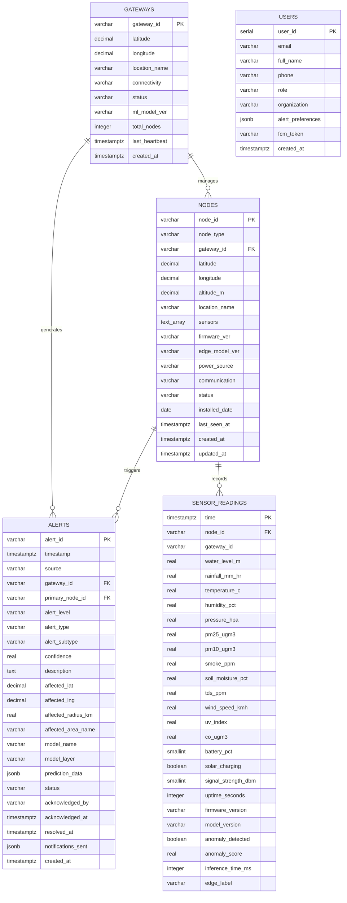

# Database Design

## Entity Relationship Diagram

The following diagram illustrates the core entities and their relationships based on the initial schema (`001_initial_schema.sql`).

```mermaid
erDiagram
    GATEWAYS ||--o{ NODES : manages
    GATEWAYS ||--o{ ALERTS : generates
    NODES ||--o{ ALERTS : triggers
    NODES ||--o{ SENSOR_READINGS : records
    
    USERS {
        serial user_id PK
        varchar email
        varchar full_name
        varchar phone
        varchar role
        varchar organization
        jsonb alert_preferences
        varchar fcm_token
        timestamptz created_at
    }

    GATEWAYS {
        varchar gateway_id PK
        decimal latitude
        decimal longitude
        varchar location_name
        varchar connectivity
        varchar status
        varchar ml_model_ver
        integer total_nodes
        timestamptz last_heartbeat
        timestamptz created_at
    }

    NODES {
        varchar node_id PK
        varchar node_type
        varchar gateway_id FK
        decimal latitude
        decimal longitude
        decimal altitude_m
        varchar location_name
        text_array sensors
        varchar firmware_ver
        varchar edge_model_ver
        varchar power_source
        varchar communication
        varchar status
        date installed_date
        timestamptz last_seen_at
        timestamptz created_at
        timestamptz updated_at
    }

    SENSOR_READINGS {
        timestamptz time PK
        varchar node_id FK
        varchar gateway_id
        real water_level_m
        real rainfall_mm_hr
        real temperature_c
        real humidity_pct
        real pressure_hpa
        real pm25_ugm3
        real pm10_ugm3
        real smoke_ppm
        real soil_moisture_pct
        real tds_ppm
        real wind_speed_kmh
        real uv_index
        real co_ugm3
        smallint battery_pct
        boolean solar_charging
        smallint signal_strength_dbm
        integer uptime_seconds
        varchar firmware_version
        varchar model_version
        boolean anomaly_detected
        real anomaly_score
        integer inference_time_ms
        varchar edge_label
    }

    ALERTS {
        varchar alert_id PK
        timestamptz timestamp
        varchar source
        varchar gateway_id FK
        varchar primary_node_id FK
        varchar alert_level
        varchar alert_type
        varchar alert_subtype
        real confidence
        text description
        decimal affected_lat
        decimal affected_lng
        real affected_radius_km
        varchar affected_area_name
        varchar model_name
        varchar model_layer
        jsonb prediction_data
        varchar status
        varchar acknowledged_by
        timestamptz acknowledged_at
        timestamptz resolved_at
        jsonb notifications_sent
        timestamptz created_at
    }
```
